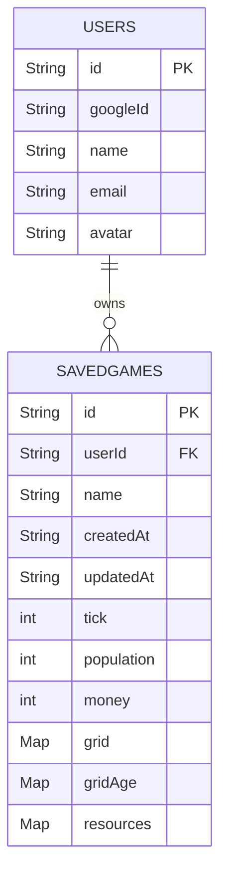

# Database Schema

```mermaid
erDiagram
    USERS ||--o{ SAVEDGAMES : owns

    USERS {
        String id PK
        String googleId
        String name
        String email
        String avatar
    }

    SAVEDGAMES {
        String id PK
        String userId FK
        String name
        String createdAt
        String updatedAt
        int tick
        int population
        int money
        Map grid
        Map gridAge
        Map resources
    }
```
