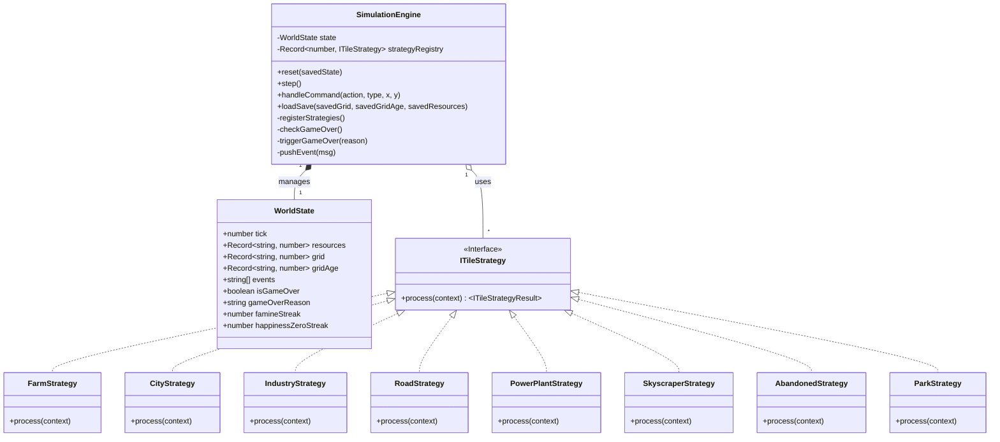

# ChaosLab Class Architecture

```mermaid
classDiagram
    class SimulationEngine {
        -WorldState state
        -Record~number, ITileStrategy~ strategyRegistry
        +reset(savedState)
        +step()
        +handleCommand(action, type, x, y)
        +loadSave(savedGrid, savedGridAge, savedResources)
        -registerStrategies()
        -checkGameOver()
        -triggerGameOver(reason)
        -pushEvent(msg)
    }

    class WorldState {
        +number tick
        +Record~string, number~ resources
        +Record~string, number~ grid
        +Record~string, number~ gridAge
        +string[] events
        +boolean isGameOver
        +string gameOverReason
        +number famineStreak
        +number happinessZeroStreak
    }

    class ITileStrategy {
        <<Interface>>
        +process(context)~ITileStrategyResult~
    }

    class FarmStrategy {
        +process(context)
    }
    class CityStrategy {
        +process(context)
    }
    class IndustryStrategy {
        +process(context)
    }
    class RoadStrategy {
        +process(context)
    }
    class PowerPlantStrategy {
        +process(context)
    }
    class SkyscraperStrategy {
        +process(context)
    }
    class AbandonedStrategy {
        +process(context)
    }
    class ParkStrategy {
        +process(context)
    }

    SimulationEngine "1" *-- "1" WorldState : manages
    SimulationEngine "1" o-- "*" ITileStrategy : uses
    ITileStrategy <|.. FarmStrategy
    ITileStrategy <|.. CityStrategy
    ITileStrategy <|.. IndustryStrategy
    ITileStrategy <|.. RoadStrategy
    ITileStrategy <|.. PowerPlantStrategy
    ITileStrategy <|.. SkyscraperStrategy
    ITileStrategy <|.. AbandonedStrategy
    ITileStrategy <|.. ParkStrategy
```
