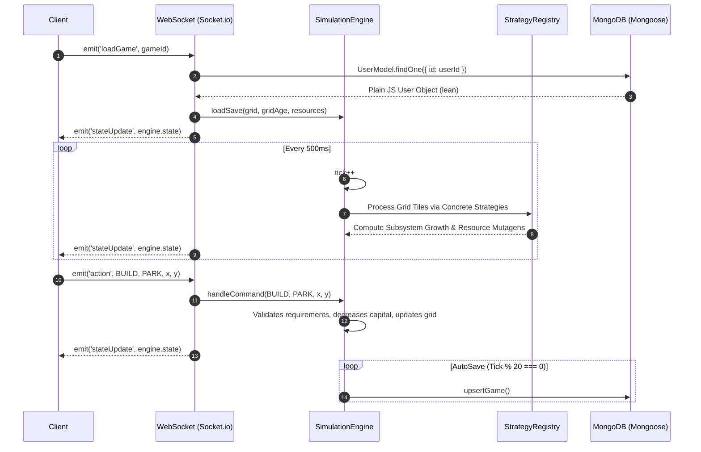

# Sequence Diagram

```mermaid
sequenceDiagram
    autonumber
    participant Client
    participant WebSocket as WebSocket (Socket.io)
    participant Engine as SimulationEngine
    participant Strategy as StrategyRegistry
    participant Mongoose as MongoDB (Mongoose)

    Client->>WebSocket: emit('loadGame', gameId)
    WebSocket->>Mongoose: UserModel.findOne({ id: userId })
    Mongoose-->>WebSocket: Plain JS User Object (lean)
    WebSocket->>Engine: loadSave(grid, gridAge, resources)
    WebSocket-->>Client: emit('stateUpdate', engine.state)
    
    loop Every 500ms
        Engine->>Engine: tick++
        Engine->>Strategy: Process Grid Tiles via Concrete Strategies
        Strategy-->>Engine: Compute Subsystem Growth & Resource Mutagens
        WebSocket-->>Client: emit('stateUpdate', engine.state)
    end
    
    Client->>WebSocket: emit('action', BUILD, PARK, x, y)
    WebSocket->>Engine: handleCommand(BUILD, PARK, x, y)
    Engine->>Engine: Validates requirements, decreases capital, updates grid
    WebSocket-->>Client: emit('stateUpdate', engine.state)
    
    loop AutoSave (Tick % 20 === 0)
        Engine->>Mongoose: upsertGame()
    end
```
