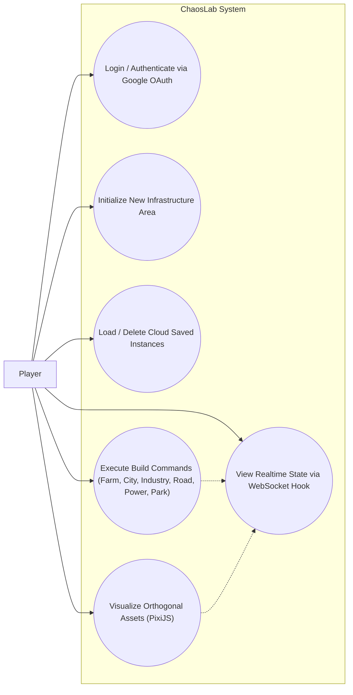

# Use Case Diagram

```mermaid
flowchart LR
    User["Player"]

    subgraph System ["ChaosLab System"]
        Auth(("Login / Authenticate via Google OAuth"))
        CreateWorld(("Initialize New Infrastructure Area"))
        ManageWorlds(("Load / Delete Cloud Saved Instances"))
        InjectCmd(("Execute Build Commands (Farm, City, Industry, Road, Power, Park)"))
        ControlSim(("View Realtime State via WebSocket Hook"))
        ViewSim(("Visualize Orthogonal Assets (PixiJS)"))
    end

    User --> Auth
    User --> CreateWorld
    User --> ManageWorlds
    User --> InjectCmd
    User --> ControlSim
    User --> ViewSim

    InjectCmd -.-> ControlSim
    ViewSim -.-> ControlSim
```
